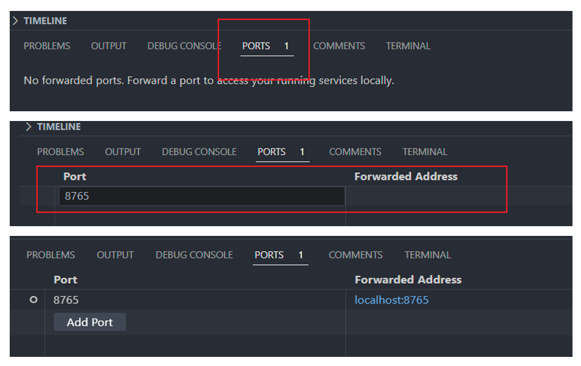

# Ugv Controller

仅供小车实时控制实验使用

## 项目要求

- 运行 linux 的电脑。如果是虚拟机，需要将虚拟机的网络配置成镜像模式
- 接入 C 座动捕系统的局域网

## 使用方法

- 下载本项目，推荐使用 vscode 打开本项目，并在 vscode 的集成终端中执行后续操作
  - 若使用 vscode 打开项目，会在打开后得到是否在容器中打开当前文件夹的提示，请忽略，具体原因将在 [调试代码小节](#调试代码) 介绍
  

- 使用终端进入本项目，假设路径为 `/path/to/ugv_ws`，后续指令均认为终端已经在这个路径下


### 构造服务

电脑在动捕系统中的局域网记为 `MY_IP`，后续指令中注意**替换为真实 ip**，一般为 `192.168.254.xxx`

```shell
docker compose build # 看网速，这个可能很慢
ROS_IP=MY_IP docker compose create
```

### Shell A: 后端服务（tf2 + foxglove）

推荐在 vscode 的集成终端中执行，因为后端服务集成了 foxglove 方便[可视化](#可视化)

```shell
FRAME_ID="动捕系统中小车的名字（默认 robotA）" docker compose up backend
```


### Shell B: 动捕系统转发

要成功转发动捕系统数据必须保证电脑已经接入局域网，能与动捕系统正常通信才行

```shell
docker compose up mocap
``` 


### Shell C: 小车的 ros 控制节点

  ```shell
  ssh wheeltec@192.168.254.231
  unset ROS_HOSTNAME
  export ROS_MASTER_URI=http://MY_IP:11311
  export ROS_IP=192.168.254.231
  roslaunch turn_on_wheeltec_robot base_serial.launch
  ```


### Shell D: 追踪
  - 打开文件 `/path/to/ugv_ws/data/rum.yml`，根据需求自行修改参数
  - 若需要更新 mpc 参数，替换 `/path/to/ugv_ws/data/mpc.mat`
  - **！！！进行上述修改时不要修改文件名！！！**
  - 使用下面指令开始追踪
    ```shell
    docker compose up run
    ```
  - 使用 `ctrl-c` 停止追踪，接着使用以下指令停止小车运动
    ```shell
    docker compose up stop
    ```
  - 记录下来的数据在 `data/` 文件夹中


- shell [A B C] 只需要实验开始时启动一次，不需要重复启动
- shell D 需要在每次更新参数后重新启动

## 可视化

- 使用 vscode 自带的端口转发功能将 8765 端口转发到本地
  
- 在 foxglove 中打开连接
  
- 在 foxglove 软件中导入本项目的配置文件 `foxglove.json`
  
- 配置文件中增加的小车模型的可视化，如果需要请按照下面的方法添加模型文件
  - 下载小车模型的 ros [项目](https://github.com/HopeCollector/ugv_descriptions.git)
  - 假设其路径为 `/path/to/catkin_ws/src`
  - 那么按照下面配置 foxglove 即可
    

## 调试代码

若实验中确实需要调整代码，比如重写目标点发送方法等，本项目也提供了方便的开发环境

### 进入开发环境

- 使用 vscode 打开本项目
- 在 vscode 中按 `ctrl-shift-p` 或 `F1` 打开命令搜索面板
- 搜素：reopen in container
- 选中并回车，稍作等待即可进入开发环境
  
- 开发环境中直接暴露出了所有与追踪相关的源代码
  
- 打开新终端时会弹出一个选择，选择 `/work` 就会进入源代码所在的文件夹
  

### 在保持开发环境的情况下调试

- 为了保证其余服务正常工作，需要再打开一个 vscode
- 使用 vscode 打开本项目
- **不要在容器中打开，我们已经打开一个了**
- 使用[上面](#使用方法)介绍的方法，为算法调试开启其他服务包括
  - [Shell A 后端服务](#shell-a-后端服务tf2--foxglove)，如果需要 foxglove 可视化调试，还需额外[添加 8765 端口转发](#可视化)
  - [Shell B 动捕系统转发](#shell-b-动捕系统转发)
  - [Shell C 小车的 ros 控制节点](#shell-c-小车的-ros-控制节点)